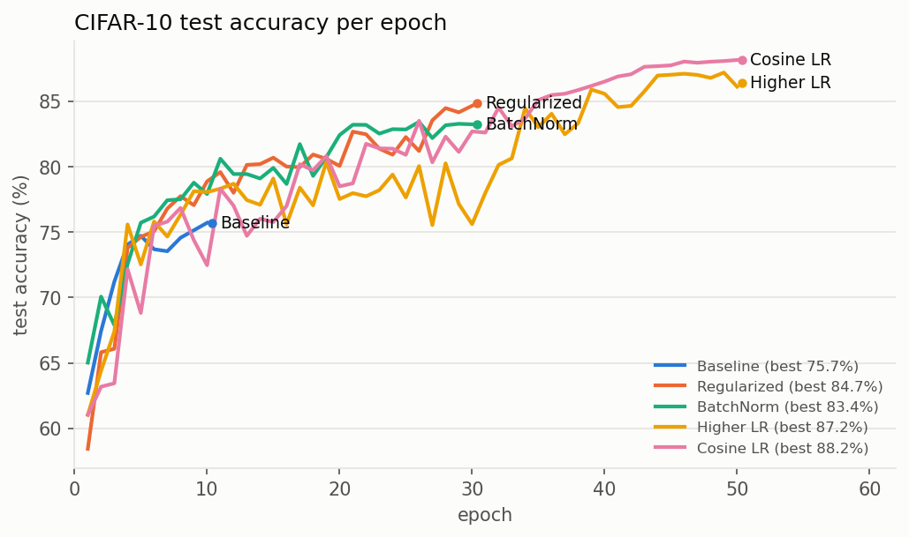
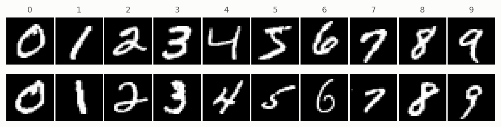
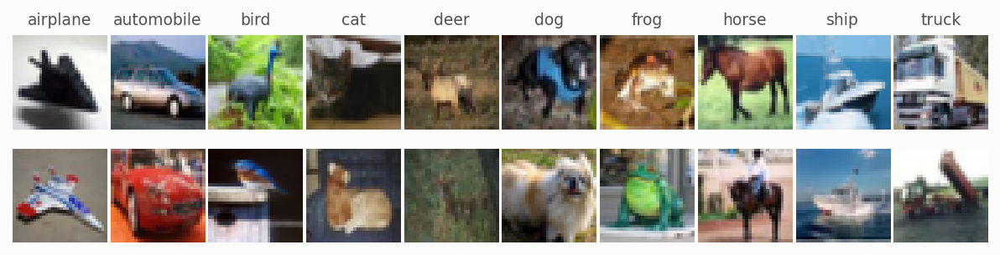
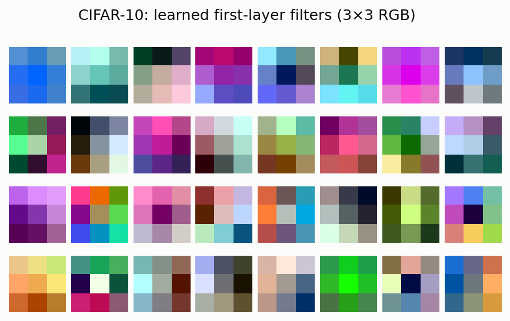
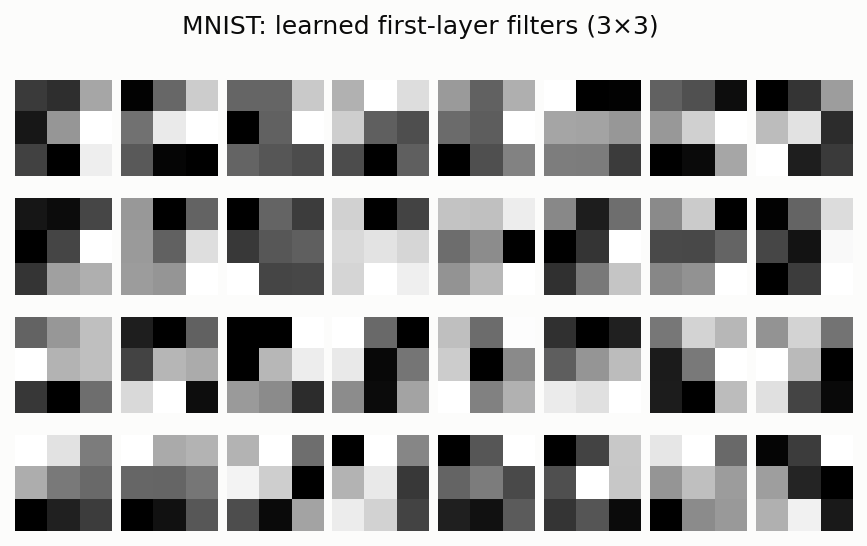
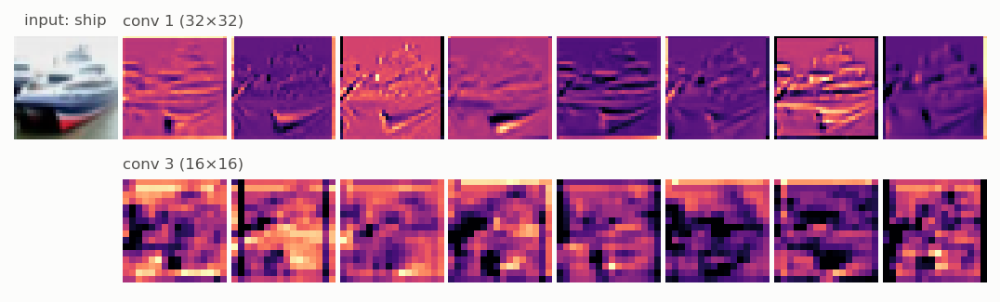

# torchLab


[](LICENSE)


A lightweight deep learning framework where **every layer, loss, optimizer, scheduler and backward pass is written by hand**, with PyTorch used only as a GPU tensor backend.

No `torch.nn.Module`, no `torch.optim`, no autograd: gradients are derived analytically and checked against PyTorch in the test suite. The goal is to understand how training really works while keeping it fast enough to train real CNNs on real datasets.

---

## Results

Best test-set accuracy obtained with the framework. These numbers are the project's validity check: they are updated whenever a new run beats them.

| Dataset | Test accuracy | Model | Training | Script |
|---|---|---|---|---|
| **MNIST** | **99.63%** | 4× Conv3×3 + BatchNorm + ReLU, Dense(256), Dropout | 15 epochs, SGD momentum, cosine LR | [`examples/train_mnist.py`](examples/train_mnist.py) |
| **CIFAR-10** | **88.16%** | 4× Conv3×3 + BatchNorm + ReLU, Dense(256), Dropout | 50 epochs, SGD momentum, cosine LR, augmentation | [`examples/train_cifar10.py`](examples/train_cifar10.py) |

All runs on a single NVIDIA A100 (CESGA FinisTerrae III). A CIFAR-10 epoch (50k images) takes **~4.6 s**, a full 50-epoch run under 5 minutes.

### CIFAR-10 ablation

Each row changes one thing with respect to the previous one; seed 0 throughout.

| Run | Change | Best acc. |
|---|---|---|
| Baseline | 4 conv + Dense, SGD momentum lr 0.01, plateau LR, 10 epochs, no regularization | 75.7% |
| Regularized | + Dropout(0.5), weight decay 5e-4, random crop + flip, 30 epochs | 84.7% |
| BatchNorm | + BatchNorm after every conv / dense layer | 83.4% |
| Higher LR | lr 0.05, 50 epochs | 87.2% |
| Cosine LR | cosine annealing 0.05 → 1e-4 instead of reduce-on-plateau | **88.2%** |



---

## What the network learns

**Datasets.** MNIST (28×28 grayscale digits) and CIFAR-10 (32×32 RGB, 10 classes).




**Learned first-layer filters.** The 3×3 kernels of the first convolution of the best models, each normalized independently.

<p>
  
  
</p>

**Feature maps.** A test image passed through the trained CIFAR-10 model: the 8 most active channels after the first conv block (full resolution) and after the second one (after pooling, 16×16).



---

## What is implemented vs. what comes from PyTorch

| Written from scratch | Taken from PyTorch |
|---|---|
| Layers: `Dense`, `ConvolutionalLayer`, `MaxPool`, `BatchNorm`, `Dropout`, `ReLU`, `Tanh`, `GAP`, `ReshapeLayer` — forward **and** backward | Tensor ops on GPU (`@`, `sum`, `exp`, indexing, …) |
| Parameter handling (`Parameter` with `.data` / `.grad`) | Convolution kernel `F.conv2d` (the conv backward is expressed as convolutions by hand) |
| Losses: `CrossEntropy`, `MSE` with analytic gradients | `unfold` / `fold` for max-pooling windows |
| Optimizers: `SGD`, `SGDWithMomentum`, weight decay | `pad`, `log_softmax` (numerical stability) |
| Schedulers: `ReducelrOnPlateau`, `CosineAnnealingLR` | `torchvision` dataset download |
| Training loop, batching, data augmentation, logging, model save/load | `torch.save` / `torch.load` |

The line is drawn on purpose: reimplementing a convolution in pure Python would teach little beyond what the hand-written backward already does, and would make CIFAR-10 impractical to train.

---

## Quickstart

```python
from myproject.model.activations import ConvolutionalLayer, BatchNorm, ReLU, MaxPool, ReshapeLayer, Dense
from myproject.model.neural_network import NeuralNetwork
from myproject.loss.loss_functions import CrossEntropy
from myproject.optimizer.optimizer import SGDWithMomentum
from myproject.scheduler.scheduler import CosineAnnealingLR
from myproject.training.trainer import Trainer
from myproject.data_scripts.data_preprocessing import process_MNIST
from myproject.utils.io import Logger

device = "cuda"
x_train, y_train, x_test, y_test = process_MNIST(device = device)

model = NeuralNetwork([
    ConvolutionalLayer(16, 1, 3, padding = 1),   # (out_channels, in_channels, kernel)
    BatchNorm(16),
    ReLU(),
    MaxPool(2, 2),
    ReshapeLayer(),
    Dense(10, 16 * 14 * 14),                     # (out_features, in_features)
])
model.to(device)

optimizer = SGDWithMomentum(model.parameters(), lr = 0.05, momentum = 0.9)
scheduler = CosineAnnealingLR(optimizer, num_epochs = 10)
trainer = Trainer(model, CrossEntropy(), Logger(), scheduler)

trainer.train_model(
    optimizer = optimizer,
    train_data = x_train, train_targets = y_train,
    eval_data = x_test, eval_targets = y_test,
    num_epochs = 10, batch_size = 64, eval = True
)
```

Every run is logged to `runs/run_<timestamp>/`: architecture, config, weights, per-epoch metrics, weight statistics and filter images. A saved model can be rebuilt with `build_NeuralNetwork("run_<timestamp>")`.

---

## Installation

```bash
git clone https://github.com/Hugopeb/torchLab.git
cd torchLab
python3 -m venv torchLab_VENV
source torchLab_VENV/bin/activate
pip install -r requirements.txt
pip install -e .
```

Run the tests (every layer, loss and optimizer is checked against `torch.autograd` / `torch.optim`):

```bash
pytest -q
```

Reproduce the results and the README figures:

```bash
python examples/train_mnist.py
python examples/train_cifar10.py
python docs/make_figures.py --cifar-best run_<timestamp> --mnist-best run_<timestamp> \
    --curve "Baseline=run_<timestamp>" --curve "Cosine LR=run_<timestamp>"
```

---

## Project structure

```
src/myproject/
├── model/          layers (activations.py) and the NeuralNetwork container
├── loss/           CrossEntropy, MSE
├── optimizer/      SGD, SGDWithMomentum
├── scheduler/      ReducelrOnPlateau, CosineAnnealingLR
├── training/       Trainer: train / eval loops, augmentation
├── data_scripts/   MNIST and CIFAR-10 loading and preprocessing
└── utils/          batching, Parameter, logging, model rebuilding
examples/           training scripts behind the results table
docs/               README figures and the script that generates them
tests/              gradient, optimizer and scheduler tests
```

---

## Scope

torchLab is a learning and experimentation tool, not a replacement for PyTorch. It is meant for understanding the mechanics of training — backpropagation through convolutions, pooling and normalization, optimizer and scheduler behaviour — and for trying out custom layers or update rules with full control over every step.
